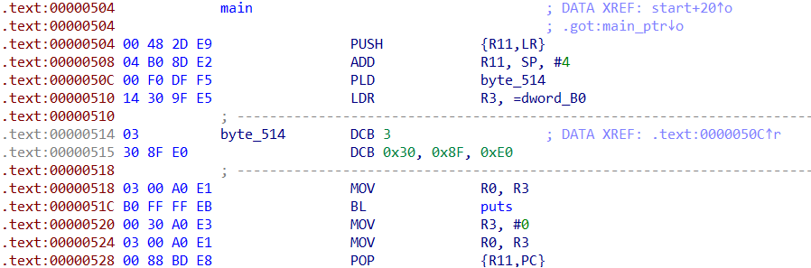
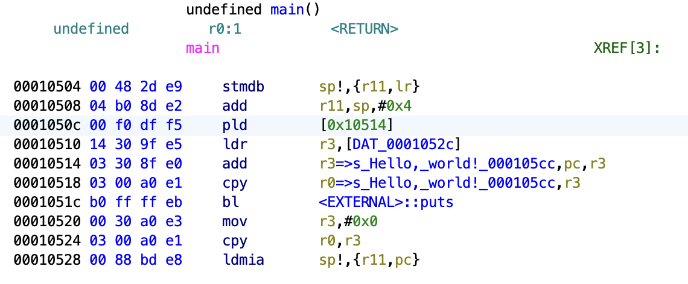
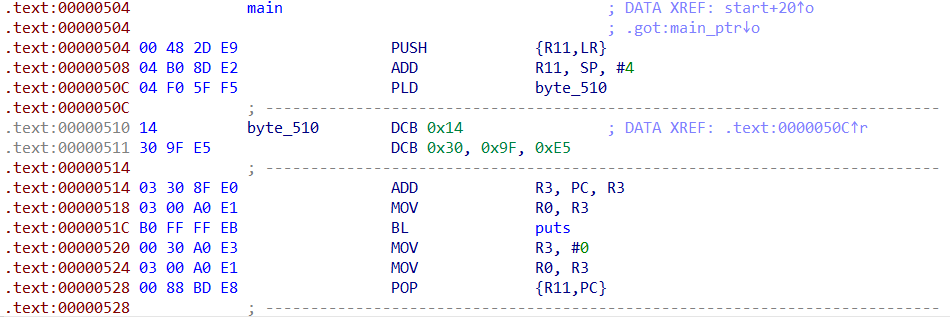
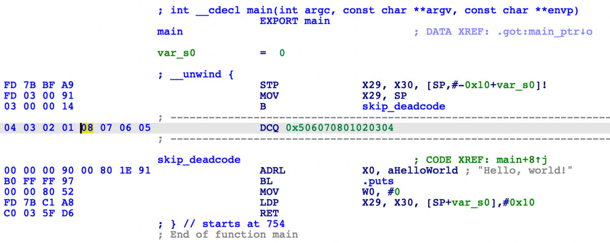
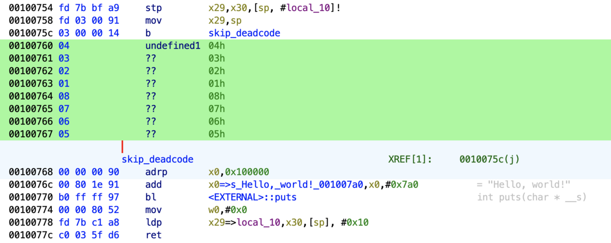
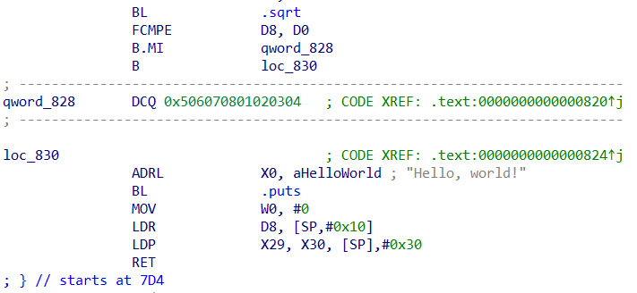
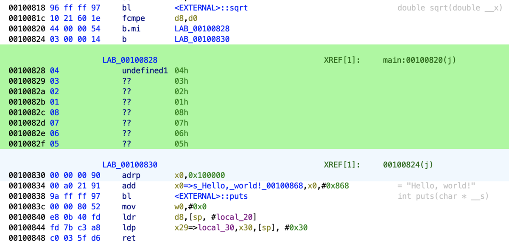

# anti-disassembly-poc

A collection of Proof-of-Concept implementations of various anti-disassembly techniques for ARM32 and ARM64 architectures.

## Implemented Techniques

### 1. PLD Instruction Insertion
The PLD instruction is used to preload data from memory into the instruction cache. This can confuse disassemblers as they may try to interpret the data at the PC location as instructions.
This technique is only available on ARM32.

#### arm/insert-pld.c

Inserts a PLD instruction that references the program counter (PC). This can confuse disassemblers as they may try to interpret the data at the PC location as instructions.

##### IDA
This technique is working on IDA.

##### Ghidra
Anti-disassembly is not succeeding in Ghidra. This is because it does not interpret the address specified in the operand of the PLD instruction. This is a good thing that it is not as multifunctional as IDA.

#### arm/insert-pld-offset.c

Similar to the above but with an offset from PC, making it more complex for disassemblers to handle.

##### IDA

#### arm/insert-pld-with-nopsled.c

Combines the PLD instruction with a NOP sled, creating a more sophisticated anti-disassembly pattern.

### 2. Dead Code Insertion
This technique is available on ARM32 and ARM64.

#### arm/skip-deadcode.c

Inserts invalid instructions (as data) after an unconditional branch, which will never be executed. This can confuse disassemblers that try to analyze all code paths.

##### IDA

##### Ghidra

### 3. Bogus Control Flow
This technique is available on ARM32 and ARM64.

#### arm/bogus-control-flow.c

Uses a conditional branch with a complex mathematical condition to hide invalid instructions. The condition is designed to always evaluate to false, but disassemblers may still try to analyze the dead code path.

##### IDA

##### Ghidra

## References
- https://kbdsmoke.me/anti-disassembly-on-arm-ida-specifically/
  - Now missing...
- https://github.com/AppleReer/Anti-Disassembly-On-Arm64

- My own blog posts:
- https://tech-blog.sterrasec.com/entry/2024/04/12/151113
- https://tech-blog.sterrasec.com/entry/2024/07/12/111416
